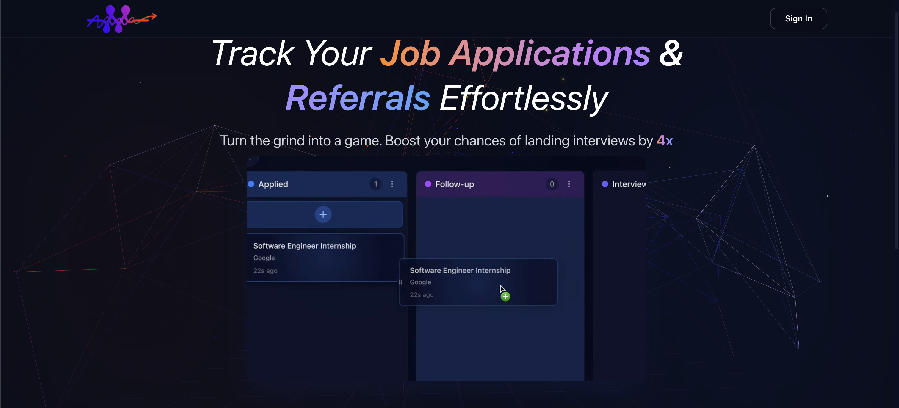

# Apptracked.com - Job Application & Referral Tracking System



## 🚀 Overview

Apptracked is a modern web application designed to help job seekers track their job applications and referrals. The application gamifies the job search process by awarding points and achievements, making the often tedious process more engaging and rewarding.

[](https://vercel.com)
[](https://www.typescriptlang.org/)
[](https://nextjs.org/)
[](https://reactjs.org/)
[](https://www.convex.dev/)
[](https://clerk.dev/)

## ✨ Features

- **Job Application Tracking**: Organize your job applications with custom status columns
- **Referral Management**: Track contacts who can refer you to companies
- **Dashboard Analytics**: Get insights into your job application progress
- **Achievement System**: Earn achievements as you progress in your job search
- **Leaderboards**: Compare your progress with other job seekers in the community
- **Profile Management**: Create and customize your professional profile
- **Community Features**: Connect with other job seekers for support and networking

## 🛠️ Tech Stack

- **Frontend**: Next.js 15, React 19, TailwindCSS, Radix UI
- **Backend**: Next.js API Routes, Convex Database
- **Authentication**: Clerk Authentication
- **State Management**: React Hooks
- **Animations**: Three.js
- **Styling**: Tailwind CSS, CSS Modules
- **Analytics**: Vercel Analytics, Schematic

## 📂 Project Structure

```
/
├── app/                  # Next.js 15 application directory
│   ├── dashboard/        # Dashboard and main app functionality
│   ├── api/              # API routes
│   └── ...               # Other app routes
├── components/           # Reusable UI components
├── convex/               # Convex database schema and API
├── hooks/                # Custom React hooks
├── lib/                  # Utility functions and API clients
├── public/               # Static assets
└── types/                # TypeScript type definitions
```

## 🚀 Getting Started

### Prerequisites

- Node.js 18+ and npm/yarn/pnpm
- A Clerk account for authentication
- A Convex account for the database

### Installation

1. Clone the repository

```bash
git clone https://github.com/yourusername/refertrack.git
cd refertrack
```

2. Install dependencies

```bash
npm install
# or
yarn install
# or
pnpm install
```

3. Set up environment variables

Create a `.env.local` file in the root directory with the following variables:

```
# Clerk Authentication
NEXT_PUBLIC_CLERK_PUBLISHABLE_KEY=your_clerk_publishable_key
CLERK_SECRET_KEY=your_clerk_secret_key
NEXT_PUBLIC_CLERK_SIGN_IN_URL=/sign-in
NEXT_PUBLIC_CLERK_SIGN_UP_URL=/sign-up
NEXT_PUBLIC_CLERK_AFTER_SIGN_IN_URL=/dashboard
NEXT_PUBLIC_CLERK_AFTER_SIGN_UP_URL=/dashboard

# Convex Database
NEXT_PUBLIC_CONVEX_URL=your_convex_deployment_url
CONVEX_DEPLOYMENT=your_convex_deployment_id
CONVEX_ADMIN_KEY=your_convex_admin_key
```

4. Start the development server

```bash
npm run dev
# or
yarn dev
# or
pnpm dev
```

5. Open [http://localhost:3000](http://localhost:3000) in your browser to see the application.

## 🔧 Development

### Convex Database

This project uses Convex as its database provider. To initialize Convex:

```bash
npx convex init
```

To push schema changes:

```bash
npx convex push
```

### Authentication with Clerk

This project uses Clerk for authentication. Set up your Clerk application at [clerk.dev](https://clerk.dev) and add the environment variables to your `.env.local` file.

## 🚢 Deployment

The easiest way to deploy this application is through Vercel:

1. Push your code to a Git repository
2. Import the project into Vercel
3. Set the environment variables in Vercel
4. Deploy

[](https://vercel.com/new/git/external?repository-url=https://github.com/yourusername/refertrack)

## 🧪 Testing

Run tests with:

```bash
npm test
# or
yarn test
# or
pnpm test
```

## 📝 Contributing

Contributions are welcome! Please feel free to submit a Pull Request.

1. Fork the repository
2. Create your feature branch (`git checkout -b feature/amazing-feature`)
3. Commit your changes (`git commit -m 'Add some amazing feature'`)
4. Push to the branch (`git push origin feature/amazing-feature`)
5. Open a Pull Request

## 📄 License

This project is licensed under the MIT License - see the [LICENSE](LICENSE) file for details.

## 👥 Team

- Brendan Sick - [GitHub](https://github.com/bsick223) | [LinkedIn](https://www.linkedin.com/in/brendan-sick/)

## 🙏 Acknowledgements

- [Next.js](https://nextjs.org/)
- [React](https://reactjs.org/)
- [Convex](https://www.convex.dev/)
- [Clerk](https://clerk.dev/)
- [TailwindCSS](https://tailwindcss.com/)
- [Vercel](https://vercel.com/)

---

Built with ❤️ by Brendan Sick
